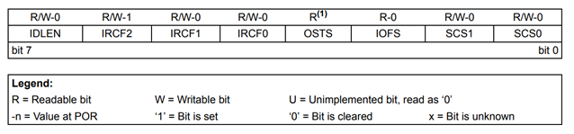
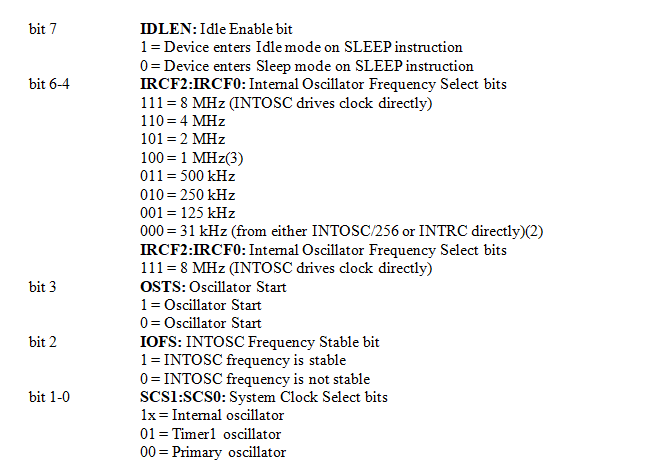
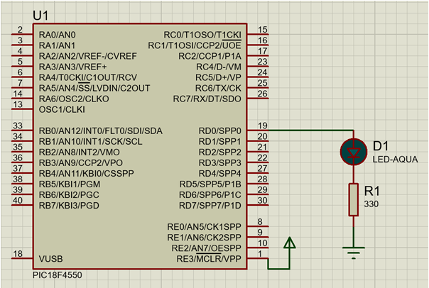

### Theory

A microcontroller is a computer in miniature form that is incorporated on a single integrated circuit. It is commonly referred to as a "system on a chip". A microcontroller typically contains one or more central processing units (CPUs), memory, and programmable input/output peripherals, as well as a small amount of RAM and program memory. Unlike the microprocessors used in personal computers or other general-purpose applications that are composed of several separate chips, microcontrollers are designed specifically for embedded applications.

The PIC18 series microcontroller is a popular microcontroller family that is commonly used in various embedded systems applications due to its low power consumption and ease of programming. The GPIO (General Purpose Input Output) pins of a microcontroller are used to connect external devices such as LEDs, switches, sensors, etc. In this experiment, we will be using a push button switch to control the blinking of an LED connected to a GPIO pin of the PIC18 microcontroller.

Overall, this experiment will demonstrate the fundamental concept of clock of a microcontroller and controlling an LED's blinking. This concept can be further extended to understand how the clock is an essential parameter used by microcontroller.

A microcontroller is made of several registers. Some used for general purpose, and some are special function registers. For an 8-bit microcontroller, all actions are performed through registers having size of 8 bits.

In this experiment, we will use a special kind of SFR inside PIC18f4550 known as OSCCON.

The OSCCON register controls several aspects of the device clock's operation, both in full-power operation and in power-managed modes.

### OSCCON: OSCILLATOR CONTROL REGISTER

  

 Fig: Oscillator Control Register

### Schematic

Fig: LED interfacing with microcontroller (Current sourcing)

